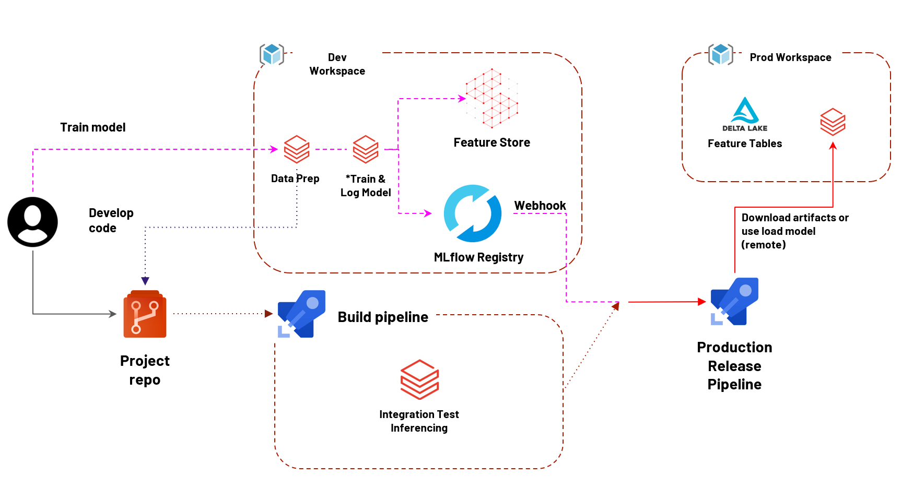

Churn Prediction with Azure Databricks
==============================

In this repository I will show you how to use Azure Databricks for the development and training of articial intelligence models letting them available in an integration and continuous delivery process (CI/CD).

The main idea is to build an end-to-end project for developing, training, deploying and monitoring machine learning models.

Steps: <br>
1. [DONE] Train a churn prediction model using Azure Databricks
2. [DONE] Deploy the machine learning model
3. [...] Build a MLOps Pipeline
4. [...] Monitor your machine learning model



------------
Project Organization
------------

```
├── imgs
|
├── notebooks
│
├── src                <- Source code for use in this project.
|   |
│   ├── features       <- Scripts to turn raw data into features for modeling
│   │   └── build_churn_features.py
|   |
│   ├── models         <- Scripts to train models and then use trained models to make
│   │   │                 predictions
│   │   ├── predict_model.py
│   │   ├── train_model.py
│   │   └── xgboost-automl.py
|   |
│   ├── monitoring  <- Scripts to monitoring models in production
|   |
│   ├── tests
|   |
│   |── utils  <- Scripts with utils functions to help about loading data, feature store, mlflow 
|   |     
│   |── __init__.py    <- Makes src a Python module
│   |
│   └── config_env.py
│ 
|── Azure Databricks - Step-by-step documentation
|
├── README.md          <- The top-level README for developers using this project.
|
├── requirements.txt   <- The requirements file for reproducing the analysis environment, e.g.
│                         generated with `pip freeze > requirements.txt`
|
```
--------